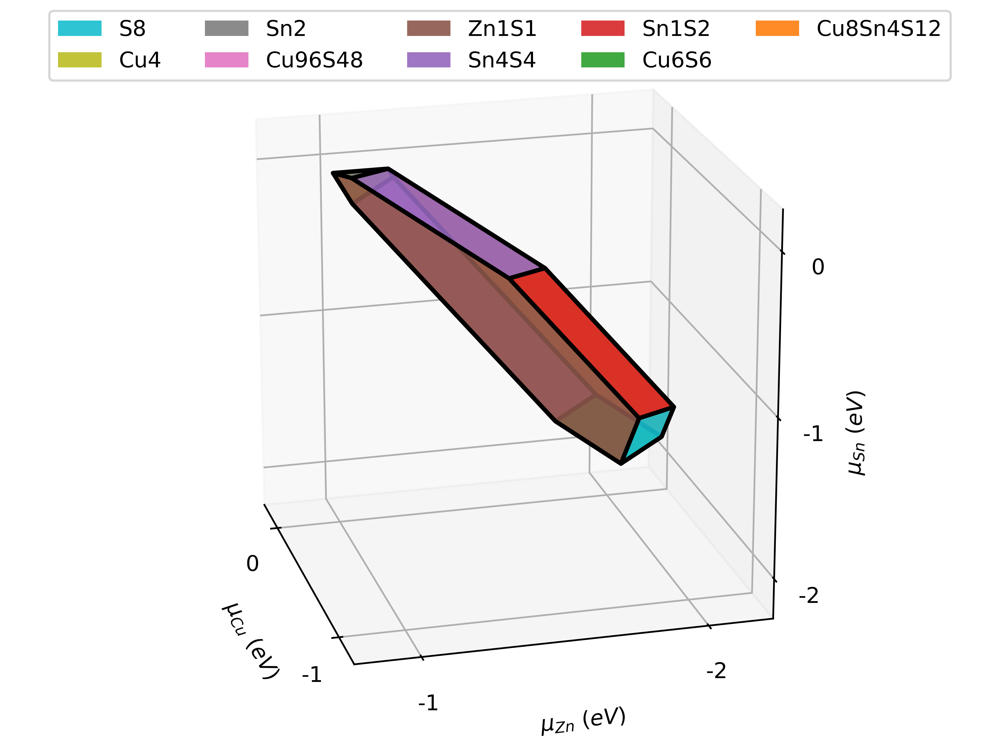

# cplapy

A 3D plotting tool for [cplap](https://github.com/jbuckeridge/cplap).

### Requirements
- Python3.x
- numpy, matplotlib
- [PyPolyhedron](https://github.com/frssp/PyPolyhedron)

### Usage
See example.  

###
variables in cddlib 
- Generator: vertex
- Halfspace: ineqaulity
 *   Inc   defines generator-halfspaces relations.  
     - index of inequalities for a given vertex
 *   Adj   defines generator-generators relations.  
 *   InInc defines halfspace-generators relations.  
     - indices of verteces (inc) on the halfsapce
 *   InAdj defines halfspace-halfspaces relations.  
